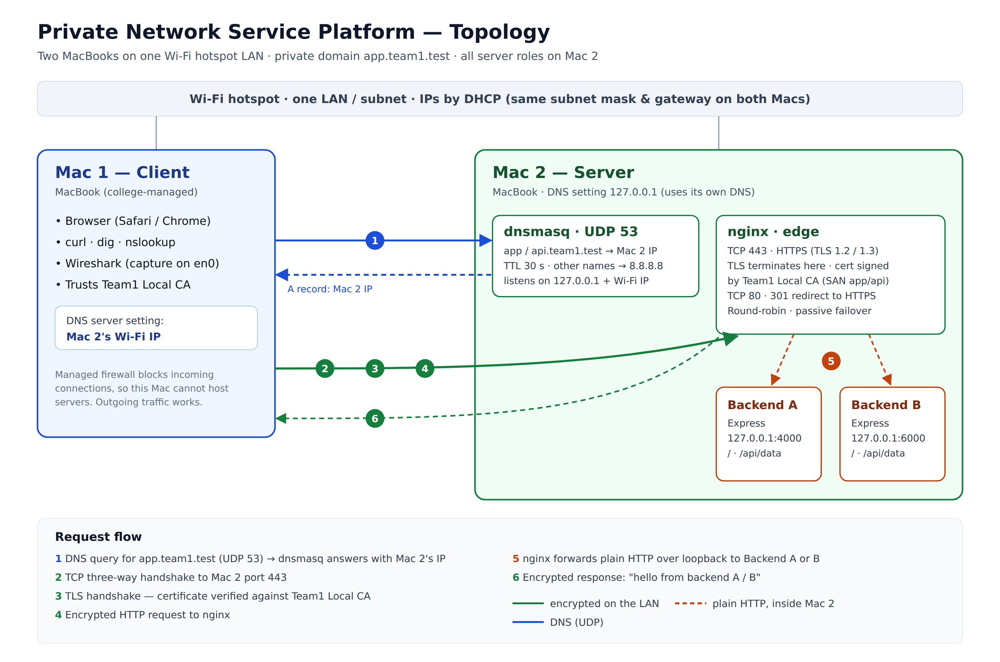

# Private Network Service Platform

A small networking project that exposes two Express backends through an HTTPS nginx edge on a private Wi-Fi hotspot LAN. A dnsmasq server on the same host resolves the private application names to the server Mac's Wi-Fi address.

## Network topology



The topology shows the intended two-Mac setup: one Mac is the client, while the other hosts dnsmasq, nginx, and both Express backends. Client traffic uses HTTPS to reach nginx. nginx sends plain HTTP over loopback to one of the backends.

## Project layout

```text
.
├── backendA/                  # Express backend A (127.0.0.1:4000 by default)
├── backendB/                  # Express backend B (127.0.0.1:6000 by default)
├── certs/                     # Trusted CA certificate and nginx server certificate/key
├── configs/
│   ├── dnsmasq/               # Private DNS example configuration
│   └── nginx/                 # HTTPS edge and backend pool configuration
├── docs/
│   ├── architecture.md        # Detailed architecture and request flow
│   └── topology.png           # Network topology diagram
└── evidence/                  # Screenshots and packet capture evidence
```

## Requirements

- Node.js and npm on the server Mac
- Two Macs connected to the same Wi-Fi hotspot LAN
- dnsmasq configured on the server Mac for `app.team1.test` and `api.team1.test`
- nginx configured to redirect HTTP to HTTPS and proxy to the two local backends
- A TLS certificate for the private hostnames, signed by the project root CA, with that CA trusted by every client

Example dnsmasq and nginx configurations are in `configs/`. The TLS CA and server certificate are in `certs/`. Update the sample dnsmasq IP address and nginx certificate paths if you clone the project to a different location or use a different server IP. Deployment scripts are not included.

The server certificate covers `app.team1.test` and `api.team1.test` and is signed by `certs/rootCA.pem`. Install and trust that CA certificate on the client Mac before using the HTTPS hostnames. The CA signing key was removed after issuing the server certificate; generating another server certificate under this same CA requires restoring that key from a secure backup. The nginx server key remains in `certs/app-key.pem` and is excluded from Git.

## Start the backends

Open a terminal on the server Mac for each backend and install its dependencies:

```sh
cd backendA
npm install
npm start
```

In a second terminal:

```sh
cd backendB
npm install
npm start
```

Backend A listens on `127.0.0.1:4000` and Backend B on `127.0.0.1:6000`. Set `PORT` to override the default for an individual backend. Both applications bind to loopback so nginx can reach them locally without exposing their ports directly on the LAN.

## Routes

Each backend provides:

| Path | Response |
| --- | --- |
| `/` | Plain-text greeting identifying the backend. |
| `/api/data` | JSON response identifying the backend. |
| `/api/status` | JSON status response with caching disabled. |
| `/api/cached` | JSON response with a 60-second cache lifetime and an ETag; matching conditional requests return `304 Not Modified`. |

Every response includes an `X-Backend` header (`A` or `B`) so the load balancer's selected backend can be identified.

Once nginx and DNS are configured, the client can access the service over HTTPS, for example:

```sh
curl https://app.team1.test/
curl https://api.team1.test/api/data
```

These hostnames require the private DNS and trusted CA setup described above. For a local backend check on the server Mac, use `curl http://127.0.0.1:4000/api/data` or `curl http://127.0.0.1:6000/api/data`.

## Ports

| Port | Service | Scope |
| --- | --- | --- |
| UDP 53 | dnsmasq DNS | Server Mac loopback and Wi-Fi interface |
| TCP 80 | nginx HTTP redirect | LAN-facing |
| TCP 443 | nginx HTTPS | LAN-facing entry point |
| TCP 4000 | Backend A | Server Mac loopback only |
| TCP 6000 | Backend B | Server Mac loopback only |

## Documentation and evidence

- [Architecture and request flow](docs/architecture.md)
- [Topology diagram](docs/topology.png)
- `evidence/phase-1/` contains screenshots covering LAN connectivity, DNS resolution, nginx, TLS, caching, and Wireshark observations.
