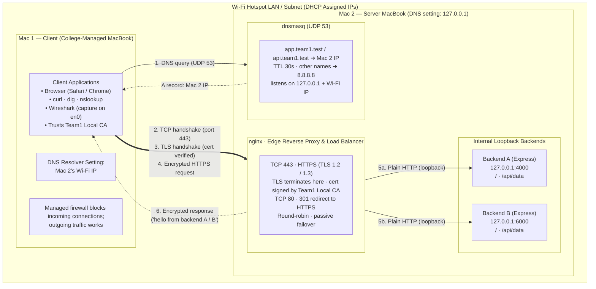

# Architecture

## Overview

This project demonstrates a private network service hosted on one MacBook and accessed from a second MacBook on the same Wi-Fi hotspot LAN. The client uses the private names `app.team1.test` and `api.team1.test`. DNS resolves these names to the server Mac's Wi-Fi IP; HTTPS terminates at nginx on that machine, which distributes requests to two local Express backends.

The network topology, host boundaries, and protocol request flow are represented below:



Example dnsmasq and nginx configurations are provided under `configs/`. The trusted CA certificate and nginx server certificate/key are under `certs/`; the CA signing key was removed after issuing the server certificate. Deployment automation is not included.

## Components and responsibilities

| Component | Host / listener | Responsibility |
| --- | --- | --- |
| Client Mac | Same hotspot LAN as server | Browser, `curl`, DNS utilities (`dig`, `nslookup`), and Wireshark capture on `en0`. It trusts `certs/rootCA.pem` (CN_Project Local Root CA). |
| dnsmasq | Server Mac, UDP 53 on loopback and Wi-Fi IP | Answers `app.team1.test` and `api.team1.test` with the server Mac's Wi-Fi IP (TTL 30s); forwards other DNS lookups to `8.8.8.8`. The server Mac itself uses `127.0.0.1` for DNS. |
| nginx | Server Mac, TCP 80 and 443 | Redirects HTTP to HTTPS on port 443, terminates TLS 1.2/1.3 using a certificate signed by CN_Project Local Root CA with `app` and `api` SANs, and round-robins proxied requests to the local backends. Passive failure handling is configured at the proxy layer. |
| Backend A | Server Mac, `127.0.0.1:4000` | Express app; serves `/`, `/api/data`, `/api/status`, and `/api/cached`. |
| Backend B | Server Mac, `127.0.0.1:6000` | Express app; serves the same paths as Backend A. |

The client Mac's managed firewall blocks inbound connections, so it acts only as a client. Backend services bind to loopback on the server Mac and are reached through nginx rather than directly over the LAN.

## Request flow

1. The client asks the server Mac's Wi-Fi IP (dnsmasq) to resolve `app.team1.test` or `api.team1.test`.
2. dnsmasq returns the server Mac's Wi-Fi IP for either private name.
3. The client opens a TCP connection to that IP on port 443. Requests to port 80 receive an HTTP redirect to HTTPS.
4. nginx completes the TLS handshake. The client validates the certificate chain against CN_Project Local Root CA, then sends its encrypted HTTP request to nginx.
5. nginx sends plain HTTP over loopback to Backend A or Backend B. Traffic between nginx and the backend stays on the server Mac.
6. The selected backend's response returns through nginx; nginx sends it to the client over the encrypted TLS connection.

## Repository map

```text
.
├── backendA/
│   ├── package.json       # Express dependency and start script
│   └── server.js          # Backend A routes; default listener 127.0.0.1:4000
├── backendB/
│   ├── package.json       # Express dependency and start script
│   └── server.js          # Backend B routes; default listener 127.0.0.1:6000
├── docs/
│   ├── architecture.md    # This document
│   └── topology.png       # Network and request-flow diagram
├── configs/
│   ├── dnsmasq/           # Example private DNS configuration
│   └── nginx/             # HTTPS edge and backend pool configuration
├── certs/                 # Root CA certificate and nginx certificate/key
└── evidence/              # Screenshots of LAN, DNS, TLS, proxy, caching, and packet checks
```

Each backend is an independent CommonJS Node.js/Express application. From its directory, run `npm start`. `PORT` can override that backend's default port. The apps listen on loopback so they are not directly exposed to other LAN hosts.

## Backend routes

| Route | Behavior |
| --- | --- |
| `/` | Plain-text greeting identifying the backend. |
| `/api/data` | JSON greeting identifying the backend; this is the API path shown in the topology. |
| `/api/status` | JSON health-style status with `Cache-Control: no-store`. |
| `/api/cached` | Backend-specific JSON response with `Cache-Control: public, max-age=60` and ETag `"v1"`; a matching `If-None-Match` receives `304 Not Modified`. |

Every route also returns `X-Backend: A` or `X-Backend: B` to identify the backend that handled the request.

## Ports and security boundaries

| Port | Protocol | Exposure / purpose |
| --- | --- | --- |
| 53/UDP | DNS | dnsmasq listens on server loopback and Wi-Fi interface. |
| 80/TCP | HTTP | nginx redirects to HTTPS. |
| 443/TCP | HTTPS | nginx is the LAN-facing application entry point. |
| 4000/TCP | HTTP | Backend A, loopback only. |
| 6000/TCP | HTTP | Backend B, loopback only. |

TLS protects client-to-nginx traffic on the LAN. The nginx-to-backend hop uses plain HTTP over loopback, as shown in the topology. The arrangement is intended for the private hotspot network; DNS and certificate trust need to be configured on the participating Macs as described in the project evidence.

## Evidence

The `evidence/phase-1/` directory contains captured setup and verification artifacts, including LAN addressing and connectivity, dnsmasq resolution, nginx routing and access logs, TLS certificate and handshake checks, HTTP cache headers/conditional requests, and Wireshark captures. These screenshots document the host-level services configured using the example files in `configs/`.
